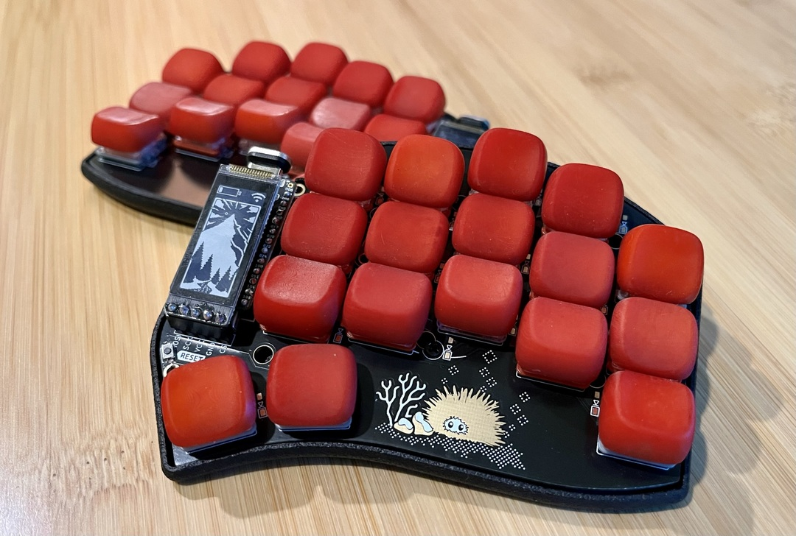
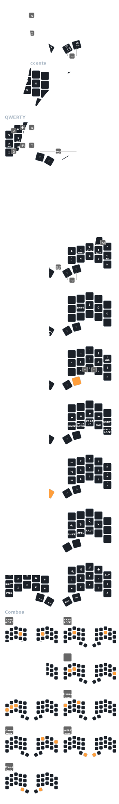

# ZMK Config

ZMK firmware configuration for Urchin keyboards, optimized for
English/Programming.

TODO: Add image of keyboad here.

## Features

- QWERTY, [Colemak-DH](https://colemakmods.github.io/mod-dh/)
- Mouse keys support
- Cursor/Scroll toggle, DPI cycling and bootloader mode keybindings
- Nice!View Urchin animation on right side of Urchin (credits: [GPeye](https://github.com/gpeye/urchin-peripheral-animation))

## Keymap

TODO: Add image of keymap diagram here.

TODO: Add link to copy/edit keymap here.

For more details, head to the [urchin.keymap](config/urchin.keymap)

## Behaviors

The keymap uses a few behaviors in order to make everything work:

- [Combos](behaviors/combos.dtsi)
- [Hold-Tap (Home Row Mods)](behaviors/hold-tap.dtsi)
- [Macros](behaviors/macros.dtsi)
- [Mod-Morph](behaviors/mod-morph.dtsi)

## References

- [Urchin Keyboard](https://github.com/duckyb/urchin)
